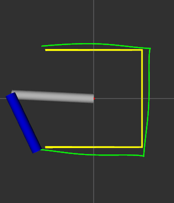

# scara_sim

## Overview
This project provides a comprehensive simulation of a 2-DOF planar SCARA robot using **ROS 2 Humble** and **Gazebo**. 

The core of the project is a custom Python implementation that handles:
- **Inverse Kinematics** (converting Cartesian X/Y coordinates to joint angles).
- **Trajectory Generation** (producing P-shaped and other Cartesian paths with specific velocity/acceleration profiles).
- **Lagrange Dynamics** (calculating the exact torques required for motion).
- **Effort Control** (publishing the calculated torques directly to the robot's joints).

The repository serves as a testbed for studying direct torque control, dynamic modeling, and trajectory tracking for robotic manipulators.

<div align="center">
  
</div>

## Dependencies
1. List of dependencies for ROS2 Humble:
- ros-humble-xacro
- ros-humble-ros-gz-sim
- ros-humble-ros-gz-bridge
- ros-humble-ros2-control
- ros-humble-ros2-controllers
- ros-humble-ign-ros2-control

2. Install dependencies
```bash
sudo apt update
sudo apt install \
    ros-humble-xacro \
    ros-humble-ros-gz-sim \
    ros-humble-ros-gz-bridge \
    ros-humble-ros2-control \
    ros-humble-ros2-controllers \
    ros-humble-ign-ros2-control
```

## Install and Start

1. Download pkg
```bash
mkdir -p some_ws/src
cd some_ws/src
git clone https://github.com/pavelmino44/scara_sim.git
```

2. Build 
```bash
cd ..
colcon build --symlink-install && source install/local_setup.bash
```

3. Launch simulation
```bash
ros2 launch scara_sim scara_sim.launch.py 
```

4. Run effort commands. In the new terminal:
```bash
cd some_ws
source install/local_setup.bash
ros2 launch scara_sim effort_publisher.launch.py
```
